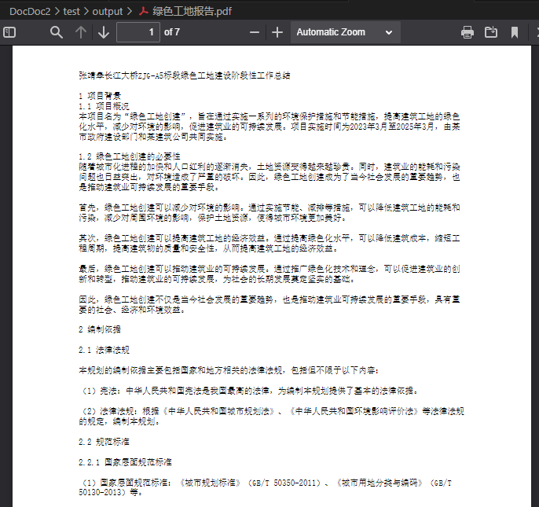
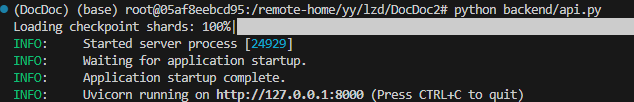
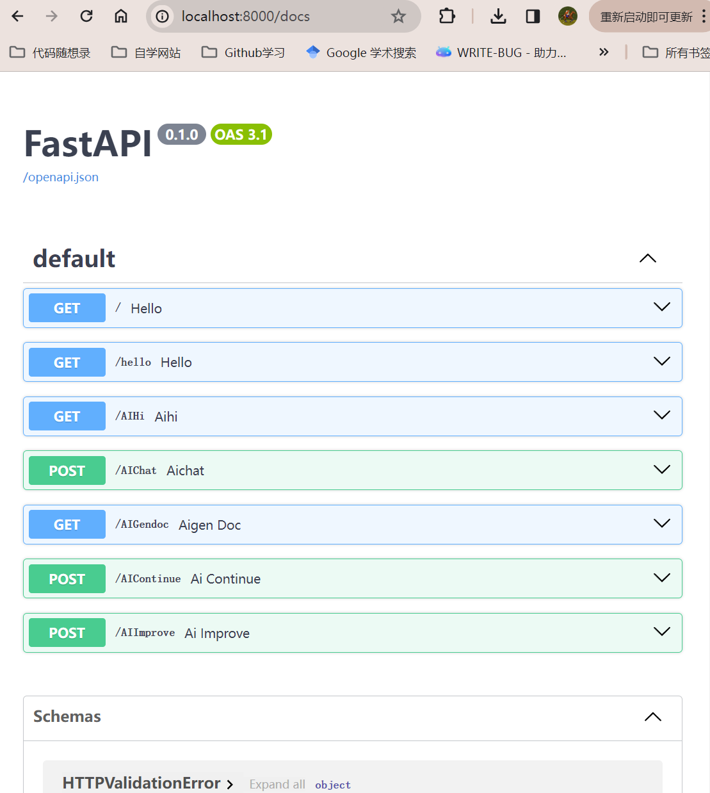
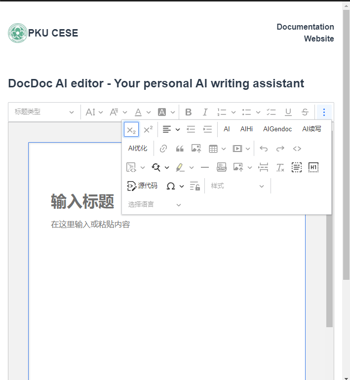
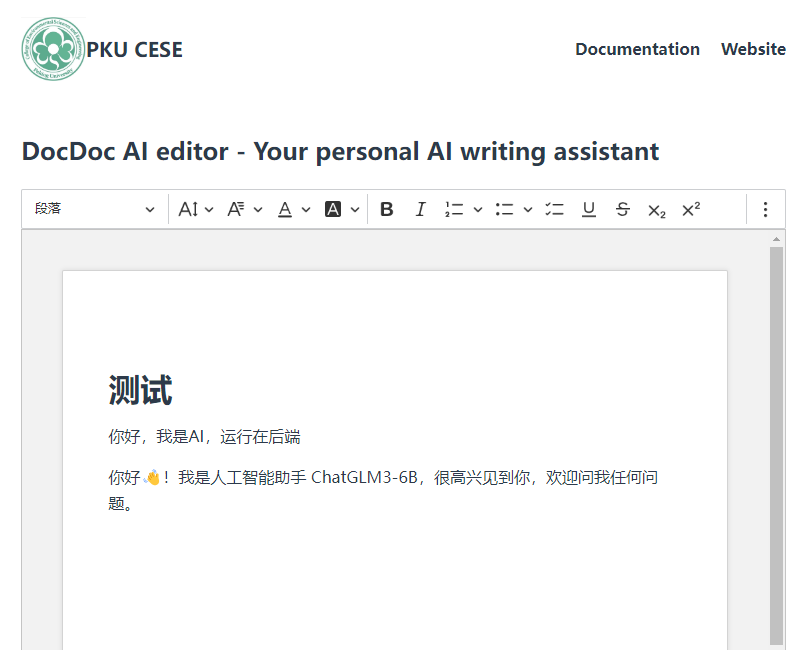
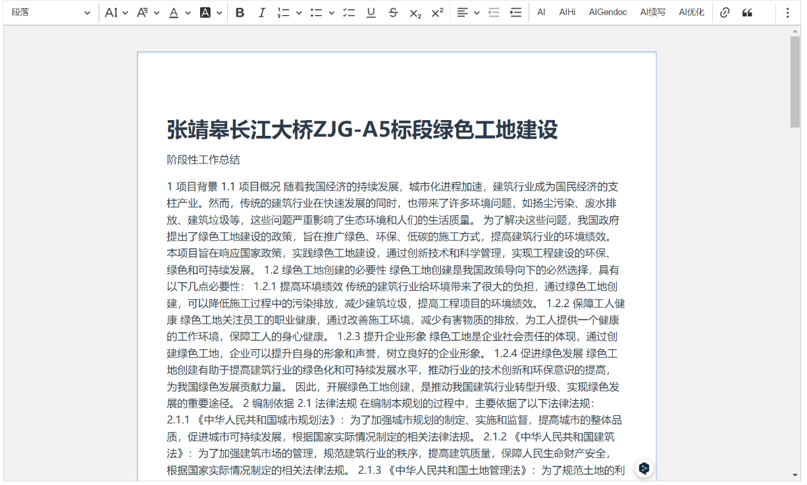
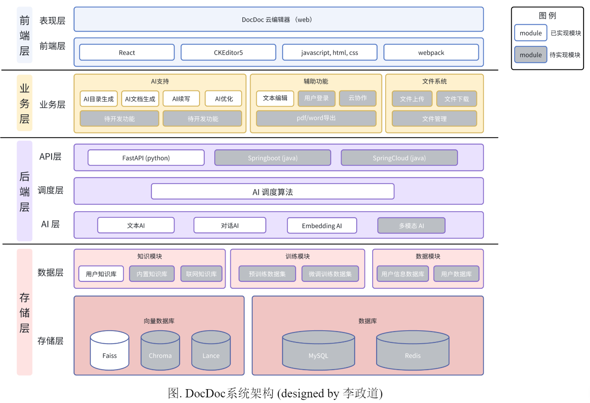

Welcome to DocDoc!   
A wonderful AIpowered writing assistant.

## 基本配置
To use this project, you shoud:
```
git clone https://github.com/LYCnight/DocDoc.git
cd DocDoc
```

then (You should hava anaconda or minconda installed in your device first)
```
conda create -n DocDoc python=3.10.13
conda activate DocDoc
```

and
```
pip install -r requirements.txt
```

## 算法组模型接口
  
在 'config.py' 中，更改你的模型路径） 

  


## 使用方法一：一键生成报告

try:
``` shell
python flowcontrol.py
```

and you'll get:




## 使用方法二：前端交互页面
先看一下结构
```shell
1. backend  - 后端
2. decoupleDoc_build_editor   - 前端
```

首先，打开后端服务
``` shell
python backend/api.py
```
稍稍等待一下，出现以下画面表示成功开启后端服务：  


对于软件组的成员，还可以在后端打开之后查看**API文档** (可以在线对API进行调试)  
在浏览器中输入
'''
http://localhost:8000/docs
'''



然后打开前端
``` shellll
cd decoupleDoc_build_editor
```
在浏览器中打开 'decoupleDoc_build_editor/sample/index.html' 即可体验AI写作器的功能



### 前端功能
- AI：点击后输出 "你好，我是AI，运行在后端"
- AIHi：点击后输出  "你好👋！我是人工智能助手 ChatGLM3-6B，很高兴见到你，欢迎问我任何问题。"

- AIGendoc: 点击后会直接输出一整篇绿色工地报告

- AI续写：选中文本后，点击AI续写，会自动续写内容
- AI优化：选中文本后，点击AI续写，会自动续写内容


## 系统架构



## 开发计划
- [ ] 算法模型接入
    - [x] ChatGLM3-6B
- [ ] 数据接入 loader
    - [ ] pdf
    - [x] word
    - [x] txt
    - [ ] Excel
- [ ] 文档分割 spliter
    - [x] NLTK
    - [x] spaCy
    - [ ] SentenceTransformers
    - [x] CharacterTextSplitter
    - [ ] RecursiveCharacterTextSplitter
    - [ ] tiktoken
    - [ ] GPT2TokenizerFast
    - [ ] LongContextReorder
- [ ] 向量数据库 embedding and vectorDb
    - [x] Fasis
    - [ ] Chromadb
    - [ ] lance
- [ ] 检索器  retriever
    - [ ] simple retriever
- [x] 提示模板  prompt
- [ ] 产品生成
    - [x] pdf
    - [ ] word
    - [ ] PPT
    - [ ] markdown
- [ ] 模型微调
- [x] API部署
    - [x] FastAPI
- [ ] 模型托管
    - [ ] FastChat
- [x] 前端
    - [x] DocEditor
    - [x] 接入LLM
- [x] cheditor-5 富文本编辑器开发 [参考博客](https://developer.aliyun.com/article/978503)
- [ ] luckysheet 电子表格开发
- [ ] PPTist 云PPT开发
- [ ] 长文本运行逻辑开发

## 展望
- [ ] 图片生成功能
- [ ] 表格生成功能
- [ ] 流式输出
- [ ] 拓展到其他任何形式的报告，文章，甚至是学术论文