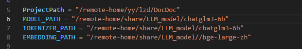
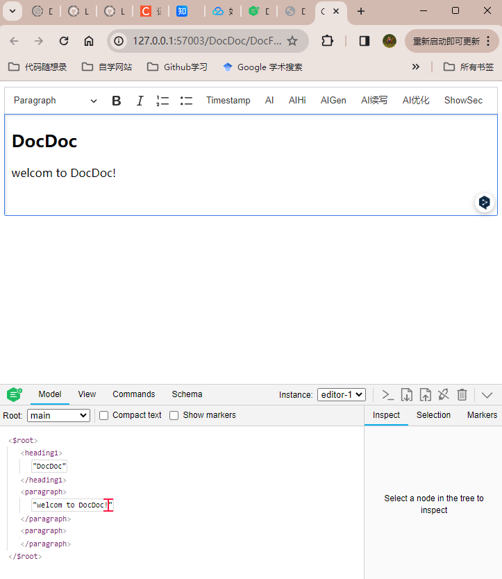
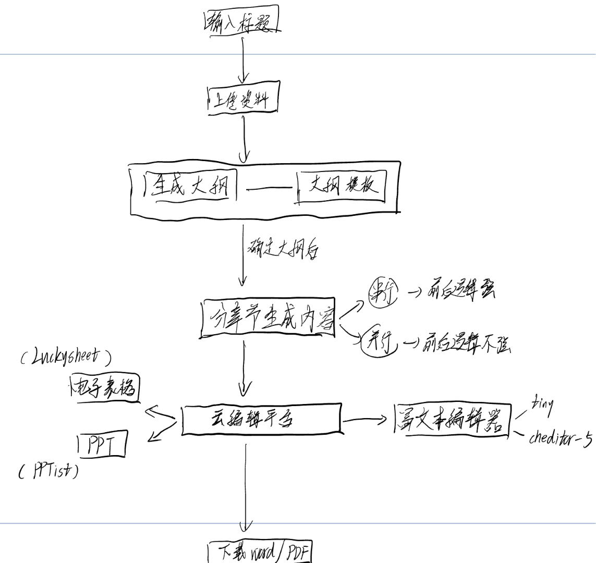
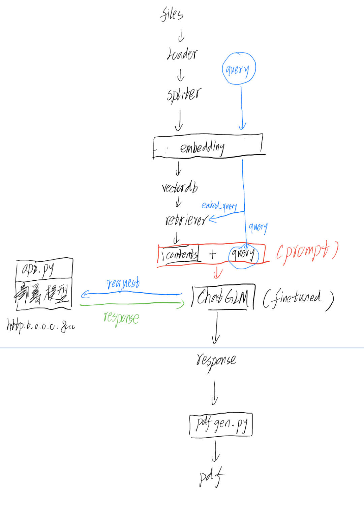

hello!  
This an AI project of PKU.

## 使用方法
To use this project, you shoud:
```
git clone https://github.com/LYCnight/DocDoc.git
cd DocDoc
```

then (You should hava anaconda or minconda installed in your device first)
```
conda create -n DocDoc python=3.10.13
conda activate DocDoc
```

and
```
pip install -r requirements.txt
```
  
  
then, change the relevant paths in `flowcontrol.py`: (My system is Linux)
  
for example:
``` shell
# Windows:
ProjectPath = "D:\ljl\DocDoc" 
MODEL_PATH = "D:\ljl\LLM_model/chatglm3-6b"
TOKENIZER_PATH = "D:\ljl\\LLM_model/chatglm3-6b"
EMBEDDING_PATH = "D:\ljl\/embed_model//bge-large-zh"
```


finally, we can have a test, try:
``` shell
python flowcontrol.py
```

and you'll get:


## 前端页面
首先，打开后端服务
``` shell
python main.py
```
然后
``` shell
cd DocFront
```
在浏览器中打开 index.html即可



## 系统架构




## 开发计划
- [ ] 大模型和 embedding模型 接入
    - [x] ChatGLM3-6B
- [ ] 数据接入 loader
    - [ ] pdf
    - [x] word
    - [x] txt
    - [ ] Excel
- [ ] 文档分割 spliter
    - [x] NLTK
    - [x] spaCy
    - [ ] SentenceTransformers
    - [x] CharacterTextSplitter
    - [ ] RecursiveCharacterTextSplitter
    - [ ] tiktoken
    - [ ] GPT2TokenizerFast
    - [ ] LongContextReorder
- [ ] 向量数据库 embedding and vectorDb
    - [x] Fasis
    - [ ] Chromadb
- [ ] 检索器  retriever
    - [ ] simple retriever
- [x] 提示模板  prompt
- [ ] 产品生成
    - [x] pdf
    - [ ] word
    - [ ] PPT
    - [ ] markdown
- [ ] 模型微调
- [ ] API部署
    - [ ] FastAPI
- [ ] 模型托管
    - [ ] FastChat
- [ ] webUI
    - [ ] DocEditor
    - [ ] 接入LLM
- [ ] cheditor-5 富文本编辑器开发 [参考博客](https://developer.aliyun.com/article/978503)
- [ ] luckysheet 电子表格开发
- [ ] PPTist 云PPT开发
- [ ] 长文本运行逻辑开发

## 展望
- [ ] 图片生成功能
- [ ] AI评论功能
- [ ] tone 改变功能 